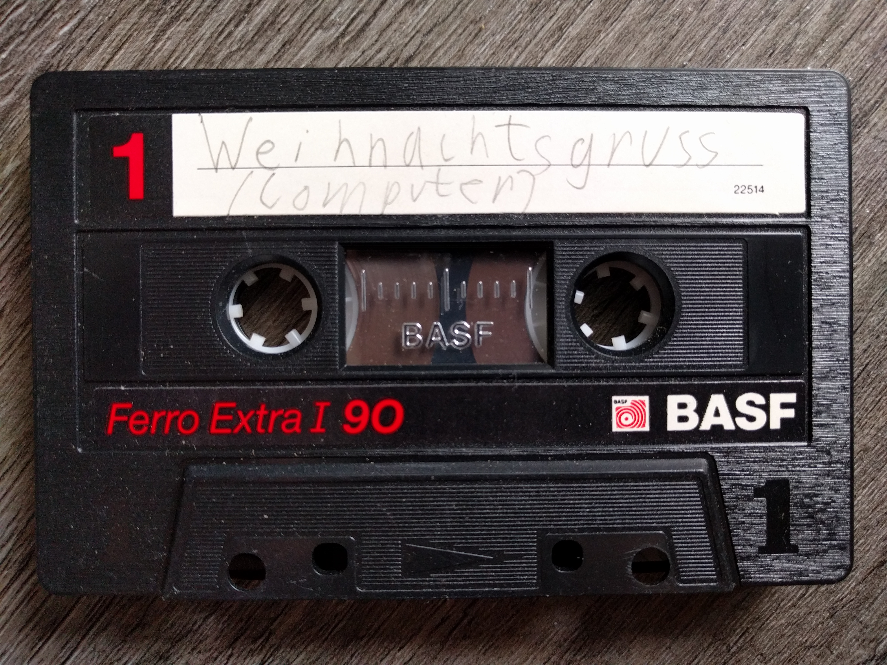

# Weihnachtsgruss (Computer)



This is probably the oldest preserved piece of software that I've ever written. 
It's called "Weihnachtsgruss" (Christmas greeting) and I guess the Christmas it refers to could be that of 1988, when I was 5 years old. 
Could also be the 1989 one; sadly, the data on the tape doesn't have a timestamp.

It's a BASIC program for an Atari 600 XL (or maybe even an 800 XL, I don't remember what I've owned) that I've found in my cassette tape collection.

I've included [the high quality WAV file of the tape section](weihnachtsgruss.wav) as well as conversions to [CAS](weihnachtsgruss.cas) and "[raw](weihnachtsgruss.raw)" format (as [a8cas](http://a8cas.sourceforge.net/) generates them) and [the original source code](weihnachtsgruss.bas) (converted from the `.raw` using [mistalro/atariconv](https://github.com/mistalro/atariconv)). 
Oh, and also a photograph of the tape that it was stored on. 
A 90 minute tape containing about 18 seconds of audio.

[The code](weihnachtsgruss.bas) doesn't do much and it also doesn't make much sense (I like the unreachable "Guten Tag"), but I'm so happy that I've found it and that I was even able to restore it.

## What I did

1. Record the original tape using a Yamaha KX-300 tape deck and a Behringer Firepower FCA1616 audio interface as a 96 kHz stereo track into Audacity.
2. Save the result as a 16 bit WAV file.
3. Convert it to CAS and "raw" using a8cas: 
    ```
    a8cas-convert weihnachtsgruss.wav weihnachtsgruss.cas
    new block...
    Attempting to recognize data block... succeeded: bit_length=0.001666
    Adjusted bit_1_0_diff = 0.000002
    End of data block at byte 132, found IRG=0.264733
    new block...
    Attempting to recognize data block... succeeded: bit_length=0.001668
    Adjusted bit_1_0_diff = 0.000019
    End of data block at byte 132, found IRG=0.246667
    new block...
    Attempting to recognize data block... succeeded: bit_length=0.001666
    Adjusted bit_1_0_diff = 0.000020
    End of data block at byte 132, found IRG=0.337937
    new block...
    Attempting to recognize data block... failed
    new block...
    Attempting to recognize data block... failed
    ```
4. Since the raw file contains the source code in a tokenized binarish version, use `atariconv` to create a text file from it again:
    ```
    ./atari weihnachtsgruss.bas
    Error:
    File number of variables= 0
    Actual number of variables = 0
    -----< Listing of file >-------------------------
    1 PRINT "Ich wuensche allen von "
    2 PRINT "ganzem Herzen"
    3 PRINT "F R O H E WEIHNACHTEN!"
    4 PRINT "MERRY CHRISTMAS !"
    5 PRINT "MERRY CHRISTMAS !"
    6 GOTO 1
    7 END
    9 PRINT "Guten Tag"
    10 GOTO 9
    -------------------------------------------------
    ```

## Author

This code was written by Tim Weber (scy), who also restored it in August of 2018.
